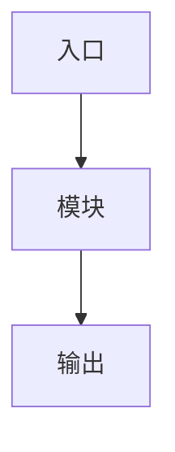

# {{TITLE}}

> [!NOTE]
> 本文档用于记录 {{TITLE}} 的设计背景、实现方式、调试过程与后续改进方向。

## 1. 背景


## 2. 目标

- [ ] 明确问题边界
- [ ] 明确输入/输出
- [ ] 明确调试验证方式

## 3. 总体结构



## 4. 关键实现

### 4.1 模块职责


### 4.2 数据流


### 4.3 控制流


## 5. 关键代码

```c

```

## 6. 调试记录

| 问题 | 现象 | 原因 | 解决 |
|---|---|---|---|
|  |  |  |  |

## 7. 小结

---

**一句话总结**：
